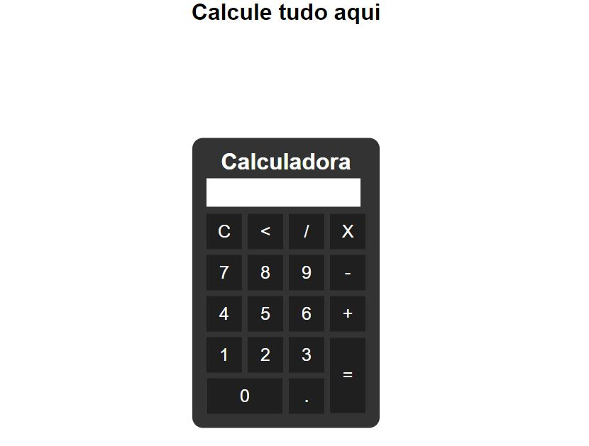

<h1 align="center"> Calculadora </h1>

Calculadora desenvolvida com o intuito de fixar os conhecimentos de Javascript  

  <a href="#-tecnologias">Tecnologias</a>&nbsp;&nbsp;&nbsp;|&nbsp;&nbsp;&nbsp;
  <a href="#-projeto">Projeto</a>&nbsp;&nbsp;&nbsp;|&nbsp;&nbsp;&nbsp;
  <a href="#-layout">Layout</a>&nbsp;&nbsp;&nbsp;|&nbsp;&nbsp;&nbsp;
  <a href="#memo-licença">Licença</a>

  

 

  

## 🚀 Tecnologias

Esse projeto foi desenvolvido com as seguintes tecnologias:

- HTML e CSS
- JavaScript
- Git e Github

## 💻 Projeto

Projeto desenvolvido para possibilitar fazer calculos com javascript

- [Visite o projeto online](https://matheuspieta.github.io/calculator/)

## :memo: Licença

Esse projeto está sob a licença MIT.

---

Feito com ♥ by Matheus Pieta
